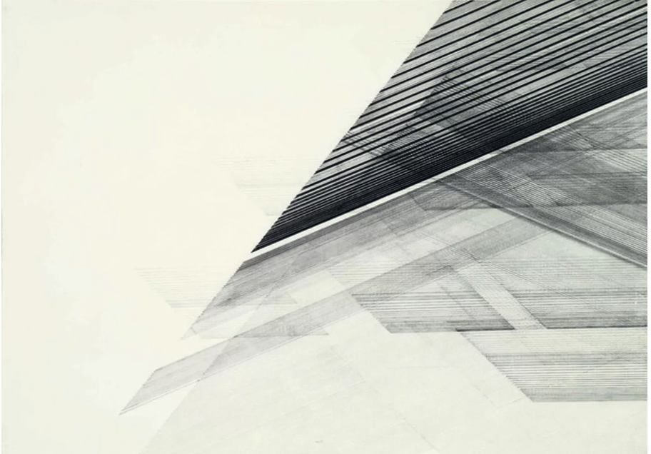
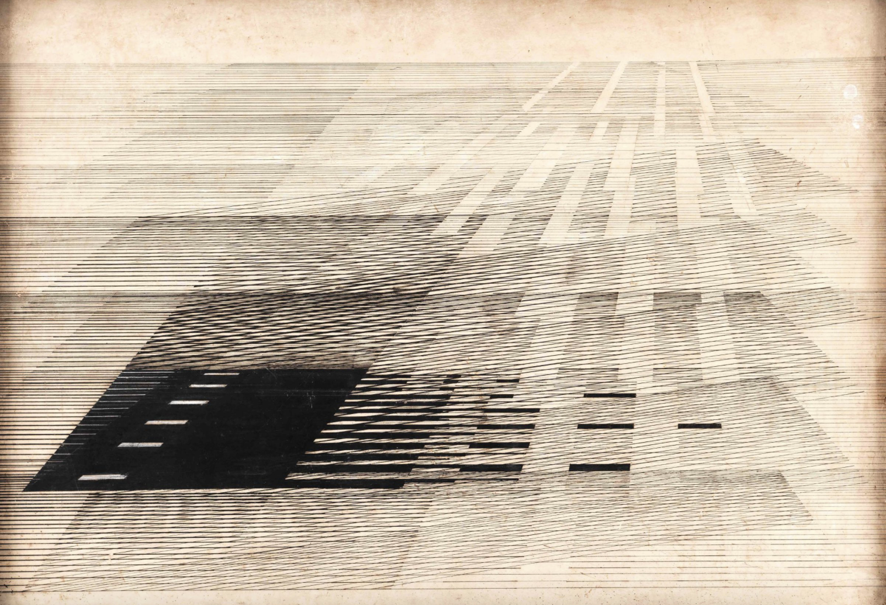

# yuxu0600_FinalAssignment

## Summary
This project is a **time-based** visual work that continues to follow the minimalist style of artist Nasreen Mohamedi.
Based on one of our group project’s static iterations, I developed this individual version focusing on the drawing of simple geometric lines and how they evolve.

## How to use?
1. When the window opens, the lines will start drawing themselves, one by one, group by group.
2. **Drag** the slider to quickly jump through the drawing progress.
3. **Click** the button to pause the animation or start it again.
4. See how many lines have been drawn so far.

## Inspiration
The inspiration came from many paintings by Nasreen Mohamedi.
I noticed that besides the variation in line thickness (which we explored in our group work), many of her works also show subtle shifts in grayscale, creating depth and rhythm.
I was also inspired by examples from the p5.js library, especially those involving progress sliders, which helped me design a more structured and logical code flow.

## Approach and Technical Overview
In my individual project I focused on:
* Made the lines appear one by one, creating a gradual reveal effect.
* Used a progress slider to see the drawing progress.
* Added a play/pause button to control animation play.
* Introduced color (grayscale) transitions so lines gradually darken as they appear.
* Used a `setInterval()` - timer to record and display progress information.

I created several custom functions to structure the program:
* `adjustStrokeAndScale()` – Dynamically adjusts line thickness and scaling based on the window size.
* `generateLineGroup()` – Randomly generates one group of parallel or tilted lines and saves them to an array.
* `generateAllLines()` – Calls generateLineGroup() multiple times to build the full composition.
* `updateControlsPosition()` – Keeps the slider and button centered when the window is resized.
* `recordProgress()` – Starts a timer that updates the progress text every 50 milliseconds.

## Reference link
https://jnaf.org/exhibition/nasreen-mohamedi-the-vastness-again-again/

https://www.artsy.net/artwork/nasreen-mohamedi-untitled-10

https://editor.p5js.org/LeoBrooks/sketches/_4jVyhh3t

https://editor.p5js.org/enickles/sketches/ZbCusCZtN

